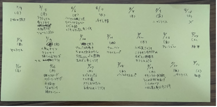
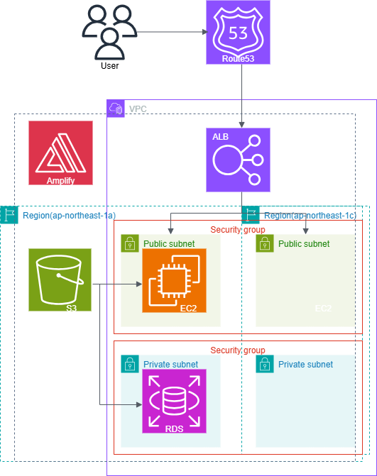
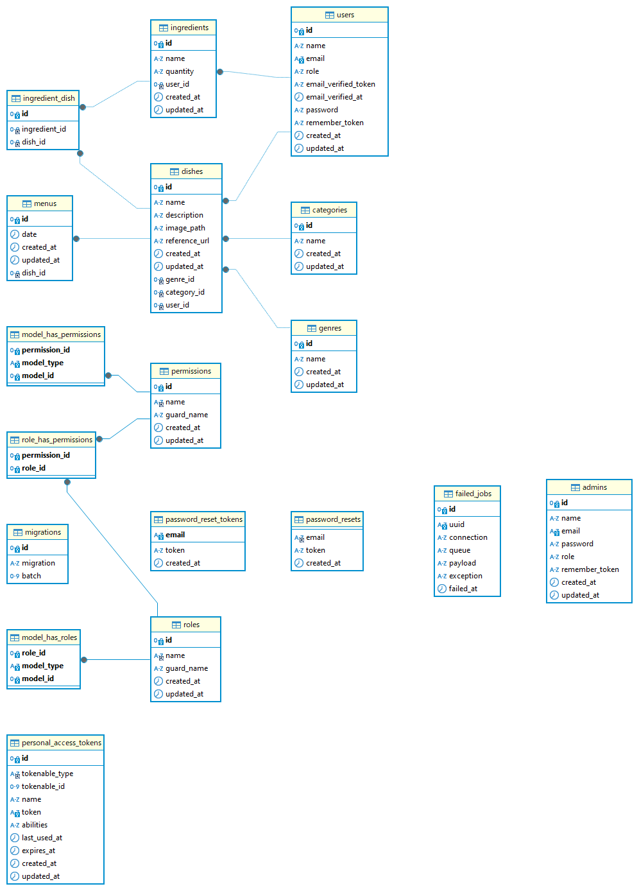

# こんだてずかん

バックエンドのリポジトリはこちら　https://github.com/manmanmeerkat/kondatezukan-backend

## 概要

「こんだてずかん」は、自分の料理レパートリーを図鑑のように管理し、献立作成、材料作成など、料理作りに関するあれこれを効率化するためのアプリです。

## サービス URL

https://www.kondate-zukan.com/

※テストユーザーの方は　 e メール　test@test.com　パスワード　 kondatetest 　でログインしてください。

## 開発に至るきっかけ

我が家では食材のロスや食料の買い出しの時間の短縮のため、下の画像のように一週間分の料理の献立をまとめて考え、その献立に必要な材料をリストアップします。その際に、「何か食べたいものある？」「うちの料理のレパートリーって何があったっけ？」という状態に陥り、時間を無駄に浪費してしまうことがあります。

過去の自分たちが築きあげてきた料理たちを記録に残し振り返りつつ、思い出す時間を短縮し、毎週の献立、材料リスト作成を効率化したい、また、自分が作った料理が図鑑のように作成、管理できれば、料理や新メニュー導入へのモチベーションも上げていくことができるのではないかと思い、このアプリを開発しました。

  
  

## こんだてずかんでできること

https://www.kondate-zukan.com/about

### 料理の登録・管理

- 登録した料理を一覧表示し、献立作成をサポート

### ジャンル・カテゴリ別絞り込み

- 料理のジャンルやカテゴリで絞り込み表示が可能

### 詳細表示

- 登録した料理の詳細を簡単に確認・編集・削除

### 新規登録

- 料理の新規登録

### 献立作成

- こんだて作成モードで日付ごとに献立を登録

### カレンダー機能

- カレンダー表示で献立予定を確認

### 材料リスト作成

- 期間を指定して材料リストを作成

### レスポンシブ対応済

- スマートフォンやタブレットなどからもご利用いただけます

### パスワード変更

### ユーザーアカウント削除

## 使用技術

- **フロントエンド**: React 18.2.0,Typescript 4.9.5,
- **バックエンド**: Laravel 10.10
- **データベース**: MySQL
- **インフラ**: AWS(EC2,RDS,S3,Amplify,ALB,ACM,Route53),Nginx
- **テスト**:PHPUnit
- **その他使用技術**: Chakra UI,react-redux,react-calendar,react-datepicker,react-router-dom,laravel/sanctum

## インフラ構成図

## ER 図

## 今後の課題

- GitHub Actions で CI/CD 環境の構築
- Controller の記述を Servise クラス に切り出すなどしてリファクタリング
- 管理者機能の作成
- インフラ面でのスケーリングなどの最適化とアプリ全体のパフォーマンス向上
- よりシンプルな使いやすさを追求した UI・UX、複雑になり過ぎない機能追加
- フロント面のデザイン・表示の仕方などユーザーが自分でカスタマイズできるような機能を充実させ、料理することが楽しくなるような自分独自の図鑑を作成できるというイメージを大切にしていきたい
- ユーザーからのフィードバックを積極的に取り入れ、幅広い層のユーザーが使いやすいと思えるプロダクトにしていきたい
