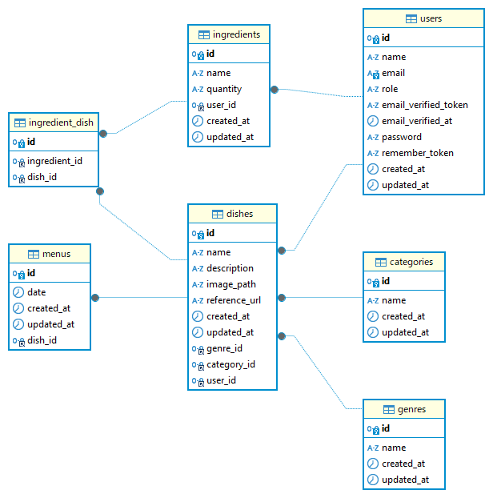

# こんだてずかん - 献立管理アプリ

## 概要

「こんだてずかん」は、日々の食事管理を効率化するための献立管理アプリです。ユーザーが簡単に料理を登録し、材料を管理し、過去の献立を検索できる機能を提供します。健康的な食生活のサポートを目的に開発され、個人の食事計画を一元管理できます。

## 主な機能

- **料理の登録・管理**: ユーザーは料理を画像付きで登録し、カテゴリやジャンル別に管理できます。
- **献立の作成**: 日付ごとに複数の料理を組み合わせて献立を作成でき、家庭やレストランの食事計画を簡単に行えます。
- **材料の管理**: 各料理に必要な材料をリスト化し、買い物リストとして活用できます。また、材料検索機能で特定の材料を使用した料理を検索可能です。
- **過去の献立検索**: 過去の献立を日付や材料で検索し、再利用することができます。
- **レスポンシブデザイン**: モバイル、タブレット、PC など、あらゆるデバイスでの快適な操作をサポートしています。

## 使用技術

- **フロントエンド**: React 18.2.0,Typescript 4.9.5,
- **バックエンド**: Laravel 10.10
- **データベース**: MySQL
- **インフラ**: AWS(EC2,RDS,S3,Amplify,ALB,ACM,Route53)
- **その他使用技術**: Chakra UI,react-redux,react-calendar,react-datepicker,react-router-dom,laravel/sanctum

## インフラ構成図

こんだてずかん ER 図.png

## ER 図

