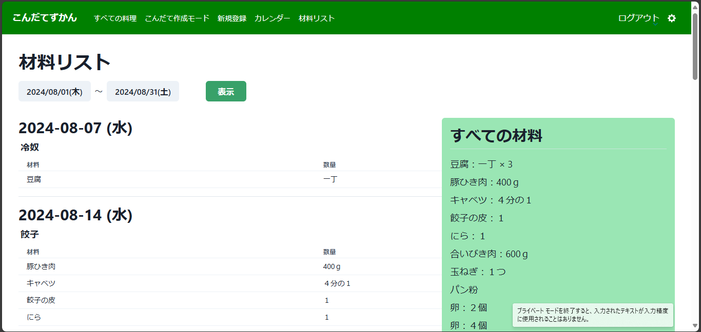

# こんだてずかん - 献立管理アプリ

## 概要

「こんだてずかん」は、日々の食事管理を効率化するための献立管理アプリです。ユーザーが簡単に料理を登録し、材料を管理し、過去の献立を検索できる機能を提供します。健康的な食生活のサポートを目的に開発され、個人の食事計画を一元管理できます。

## 開発に至るきっかけ

我が家では食材のロスや食料の買い出しの時間の短縮のため、一週間文の料理の献立をまとめて考え、その献立に必要な材料をリストアップします。その際に、「何か食べたいものある？」「うちの料理のレパートリーって何があったっけ？」という状態に陥り、時間を無駄に浪費してしまうことがあります。

過去の自分たちが築きあげてきた料理たちを記録に残し振り返りつつ、思い出す時間を短縮し、毎週の献立、材料リスト作成を効率化したい、また、自分が作った料理が図鑑のように作成、管理できれば、料理や新メニュー導入へのモチベーションも上げていくことができるのではないかと思い、このアプリを開発しました。

  

    
作成する献立表

    
  

  

    
買い出し材料リスト

    
  

### アプリの特徴

献立作成アプリやレシピ管理アプリは既存のものもいくつかありますが、このアプリは ○○ 図鑑のように収集感覚で料理のレパートリーを増やすモチベーションアップにつながるような管理に特化したアプリにしていきたいと考えています。

## 主な機能

- **料理の登録・管理**: ユーザーは料理を画像付きで登録し、カテゴリやジャンル別に管理できます、また、メモや参考にしている URL や材料の登録も行えます。
- **料理の検索・絞り込み**: 登録した料理はジャンルやカテゴリごとに絞り込み表示ができます。使用する材料から料理を検索することもできます。
- **献立の作成（カレンダー機能）**: 日付ごとに複数の料理を組み合わせて献立を作成でき、カレンダーからも登録されている献立が確認できます。
- **材料リストの作成**: 材料リストを表示させる期間を選択して、指定した期間の献立に必要な材料を表示させることができます。
- **C レスポンシブデザイン**: レスポンシブ対応もしており、スマホからもご利用いただけます。

- **その他の機能**:　ログイン・ログアウト、ユーザー登録、ユーザーアカウント削除、パスワード変更。

## 使用技術

- **フロントエンド**: React 18.2.0,Typescript 4.9.5,
- **バックエンド**: Laravel 10.10
- **データベース**: MySQL
- **インフラ**: AWS(EC2,RDS,S3,Amplify,ALB,ACM,Route53)
- **その他使用技術**: Chakra UI,react-redux,react-calendar,react-datepicker,react-router-dom,laravel/sanctum

## インフラ構成図

こんだてずかん ER 図.png

## ER 図

